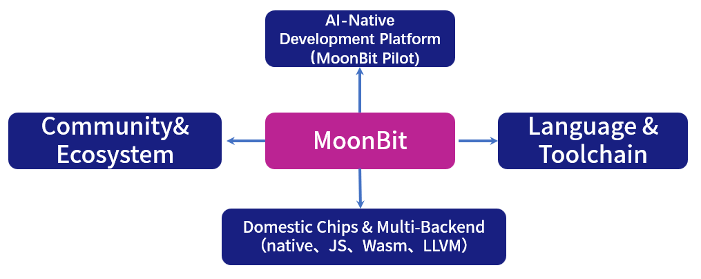
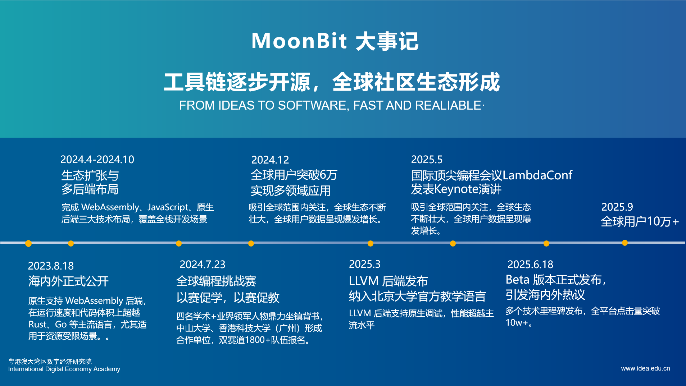

# MoonBit三周年 | 用代码写就AI时代的语言答卷
- 博客作者：MoonBit团队
- 博客地址：<https://www.moonbitlang.cn/blog/moonbit-third-anniversary>
---
- 读者：evinyang
- 时间：2025年9月19日
---
- 我们相信，语言不仅是编程的工具，更是人与 AI、人与复杂软件系统之间的桥梁
- **AI时代需要新的语言，而这件事值得去做**
- 带着这样的信念，MoonBit 踏上了这条看似孤独，却至关重要的道路
- 2025年，MoonBit推出了`MoonBit Pilot`—— 首个自底向上构建的 AI原生开发工具
    - AI从“编程助手”真正升级为“软件合成引擎”
    - 能够高效完成代码生成、调试与大规模重构
    - 在真实场景中展现出5–10倍的效率提升，仅仅耗时7分钟完成复杂任务修复，远超传统助手
    - **首次呈现无需人类接管的L4软件交付能力的工程闭环雏形**
- MoonBit的发展大体可以从三个方面去理解:
    - 语言与工具链的不断打磨
    - AI原生探索的深入
    - 社区与生态的日渐壮大
## 工作重心

- **核心工作是持续打磨 MoonBit 语言与工具链**
    - 编译器
    - IDE
    - 多后端支持（Wasm、JavaScript、Native、RISC-V）
- **向上，拓展AI原生的开发范式**
    - AI代码生成到文档式编程
    - 智能化调试与协作
    - 正在探索如何成为**AI与开发者之间**的“原生接口”，为未来的软件工程提供新范式
- **向下，深耕国产芯片与多后端生态**
    - 与国产芯片的适配，在 RISC-V 等新兴平台上开展编译工具链研发
    - 推动MoonBit在**嵌入式与边缘计算**场景中落地应用，助力基础软件与硬件生态的自主发展
-  **向外，建设开放的社区与生态**
    - 举办两届全球编程创新挑战赛（MGPIC）
    - 语言进入多所高校课程体系，建立起教学与研究的桥梁
    - 通过Mooncakes.io包管理平台与MoonBit Pilot AI工具，持续壮大开源生态
## 产品进展：拥有系统性技术护城河的基础软件公司
### MoonBit：国内首个工业级编程语言
- MoonBit在语言与工具链层面不断演进
- 以现代化的语法和类型系统为核心
- 提供了可以在边缘端运行的云IDE
- 覆盖全栈生态的`Native`、`Wasm`、`JavaScript`等多后端支持
- 性能与跨平台能力上展现出工业级水准
- 在后端硬件支持上，MoonBit支持国产芯片开发，性能媲美C，且代码可以直接以原生形式运行在嵌入式硬件之上
- `VSCode`插件集成类型检查、智能提示与调试功能，让开发体验逐渐完善
- `Mooncakes.io`包管理平台也已托管超过两千个软件包
- **支持与Python的无缝互操作，可以一键调用python库**
- 逐步进入高校课堂和`WebAssembly Component Model`官方文档，走向国际标准体系
### MoonBit Pilot：全球领先的端到端软件交付平台
- 自底向上构建的AI原生代码助手 `MoonBit Pilot`
- `MoonBit`+ `MoonBit Pilot`+ `LLM` 相辅相成
- 共同构建了一个自底向上的三位一体平台：使AI从 “辅助工具” 升级为真正的“软件合成引擎”
- 依托 `Segment` 并发机制与 `SubAgent` 系统，支持大规模并行处理，在真实场景中效率提升 `5–10` 倍
- 提供原生语义查找与重构功能，降低 `token` 消耗与推理成本
- 实测显示,速度远超 `Cursor` 与 `Codex`，率先展现出 **`L4` 级别的软件交付能力**
## 知识开源&社区生态

## 未来
- MoonBit的目标还希望**成为一家商业上成功的公司**
- **中国需要有属于自己的平台**，去吸引和承载更多优秀人才投身基础软件
- MoonBit希望通过自身的成长，让更多开发者看到这个领域的价值与前景，并在这里实现自我价值
- 真正的成功，不只是技术和产品的突破，更是让更多人愿意加入，共同推动社会的长期进步
