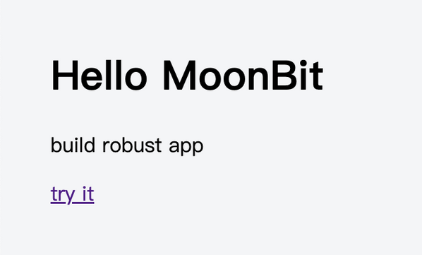

# 在MoonBit中引入Elm架构：用简单原则打造健壮的Web应用
- 作者：MoonBit团队
- 时间：2025年4月16日
- [博客链接](https://www.moonbitlang.cn/blog/rabbit-tea#)
---
- 读者：evinyang
- 时间：2025年11月7日
---
## Elm框架
- Elm是`纯函数式编程语言`为构建前端Web应用程序而生
- 编译为JavaScript，强调简洁性、性能和健壮性

- Elm`静态类型检查`确保应用程序不会抛出运行时异常，提高可靠性
- Elm架构强制执行`单向数据流`，这使得`状态管理`变得可预测且简单

- [简单介绍Elm语言❓](简单介绍Elm语言.md)
## 纯函数
- 纯函数是指函数没有`副作用`，使得代码易理解和调试

- [关于纯函数没有副作用❓](关于纯函数没有副作用.md)
## 创新
- 受Elm启发，使用Moonbit语言开发了名为Rabbit-TEA的前端Web框架
---
# 为什么选择 MoonBit？
- 函数式编程的兴起推动了React从基于类像React Hooks演进

- Javascript生态虽已有支持函数式风格的框架和库，但缺乏诸如模式匹配等特性

- MoonBit和Javascript等效代码对比
```mbt
let x = match y {
  a => value1
  b => value2
  c => value3
}
f(x)
```
```js
var x = null;
if (y == a) { x = value1 }
else if (y == b) { x = value2 }
else { x = value3 }
// x 可能会在这里被意外修改！
return f(x);

// 或者
const x = y == a ? value1 : (y == b ? value2 : value3);
return f(x);
```
- 函数`validate_utf8`检查输入的 bytes 是否是有效的 UTF-8 序列：
```mbt
fn validate_utf8(bytes : Bytes) -> Bool {
  loop bytes {
    [0x00..=0x7F, ..xs]
    | [0xC0..=0xDF, 0x80..=0xBF, ..xs]
    | [0xE0..=0xEF, 0x80..=0xBF, 0x80..=0xBF, ..xs]
    | [0xF0..=0xF7, 0x80..=0xBF, 0x80..=0xBF, 0x80..=0xBF, ..xs] => continue xs
    [_, ..] => false
    [] => true
  }
}
```
- MoonBit 是一种`面向表达式`的语言，变量默认是不可变的
```
- 完全支持模式匹配——函数式编程语言流行已久的特性
- 支持多种后端，包括 JavaScript、WebAssembly 和 native 后端
```
---
# Rabbit-TEA 如何工作
## TEA 架构——由 Model、View、Update 组成
- `Model`：App 的状态，由不可变的数据结构组成。
- `View`：App 的视图，声明了如何将 Model 显示为 HTML、用户的操作触发什么消息。
- `Update`：App 的逻辑，处理用户触发的消息，将旧的 Model 转换为新的 Model。
## 完整的计数器程序
```mbt
typealias Model = Int
let model = 0

enum Msg {
  Increment
  Decrement
}

fn update(msg : Msg, model : Model) -> (Command[Msg], Model) {
  match msg {
    Increment => (none(), model + 1)
    Decrement => (none(), model - 1)
  }
}

fn view(model : Model) -> Html[Msg] {
  div([
    h1([text(model.to_string())]),
    button(click=Msg::Increment, [text("+")]), // button1
    button(click=Msg::Decrement, [text("-")]), // button2
  ])
}

fn main {
  @tea.startup(model~, update~, view~)
}
```
- `Msg` 类型类似于事件

- `update` 函数：`函数无副作用`
```
- 点击增加按钮，触发运行时向 update 函数发送 Increment 消息以及当前的 model
- 并不会直接修改 model，基于旧值创建一个新的 model 并返回
- 整个函数是无副作用的
- 还返回一个 Cmd 类型，它表示一个未执行的操作
```
- `view` 函数：新的 model 将通过 view 函数渲染为 HTML
---
# 声明式视图: HTML EDSL
## EDSL——内嵌领域特定语言
- 通过利用编程语言已有的语法结构设计的 DSL，不需要额外的预处理和编译步骤
- [简单介绍内嵌领域特定语言❓]()
## `labeled argument` 语法糖
- 定义一组辅助函数
- 通过类型来提示用户参数的作用
- 避免滥用模糊和令人困惑的 String 类型
```mbt
fn view() -> Html[Msg] {
  div([
    h1([text("hello MoonBit")]),
    p([text("build robust app")]),
    a(href="moonbitlang.com", target=Blank, [text("try it")]),
  ])
}
```

## 标签`<a>`
- 辅助函数的类型定义如下：
```mbt
pub(all) enum Target {
  Self
  Blank
}

pub fn a[M](
  style~ : Array[String] = [],
  id? : String,
  class? : String,
  href~ : String,
  target~ : Target = Self,
  childrens : Array[Html[M]]
) -> Html[M]
``` 
- 除了唯一的 `childrens`参数，其他所有参数都是`labeled argument`，根据需要可以声明为`可选的`，或者设置`缺省值`。

- 未来考虑在 MoonBit 中引入类似 JSX 的拓展语法
```
- 什么是JSX？❓
```
---
# 消息与模式匹配
- `TEA`架构充分利用了`模式匹配`和`带标签联合类型`
- 用户定义的 Msg 可以视情况带上额外的数据，使得 update 处理消息时更加安全和灵活
## 一个场景
```
- 对于一个 input 元素，假如希望在用户输入的同时，处理它的值并将结果显示在另一个元素 p 中。

1.在 Msg 类型中增加一个带 String 数据的 enum constructor——GotInputChange
2.GotInputChange 的类型和 input 中 change 参数的类型都是 (String) -> Msg
3.在修改 input 的值时，会被打包进 GotInputChange 并发送给 update 函数处理
```
- 场景代码
```mbt
enum Msg {
  GotInputChange(String)
}

fn update(msg : Msg, model : String) -> (Cmd[Msg], String) {
  match msg {
    GotInputChange(value) => {
      ...
      (none(), value)
    }
  }
}

fn view(model : String) -> Html[Msg] {
  div([
    p([text(model)])
    input(input_type=Text, value=model, change=Msg::GotInputChange),
  ])
}
```
## MoonBit的穷尽性检查
>下次 Msg 增加新的 enum constructor 时，IDE 将会提示相关的 pattern matching 需要处理新的 case，减少运行时错误。
---
# 管理副作用
## `Cmd`类型管理函数的副作用
- 副作用即修改外部状态、与外部系统交互的操作
- 所有的这些操作被封装为 Cmd
```
- 请求浏览器记录 URL History
- 滚动浏览器视图
- 向服务器发送 JSON 请求并处理返回的数据
```
- 未执行的动作，当它被 Update 函数的返回时，才会被 Rabbit-TEA 的 runtime 触发执行
## 例子演示
```
1.用户点击相关的卡片时，先将界面转换为加载状态
2.通过 http 请求加载卡片的内容
3.@http.get 返回了一个 Cmd
4.第一个参数是请求的 URL，第二个参数声明期望的数据格式和处理响应的方法
```
```mbt
enum Msg {
  GotCardText(Result[String, String])
  ClickCard(Int)
}

pub fn update(msg : Msg, model : Model) -> (Cmd[Msg], Model) {
  match msg {
    ClickCard(id) => (
        @http.get("/api/card/\{id}", expect=Text(GotCardText)), 
        Loading)
    GotCardText(Ok(text)) => (none(), Editing(text))
    GotCardText(Err(_)) => (none(), NotFound)
  }
}
```
- 服务器响应请求时触发`GotCardText`这个消息

- 对响应进行分类讨论
```
- 成功：更新 model 以便 view 向用户展示内容
- 失败：跳转到 NotFound 页面
```
>Cmd 模式鼓励用户`避免`在一个函数中交替地触发`副作用`和更新 Model，从而防止 update 和 view 同时存在两个 Model 的数据来源，`保证程序状态的一致性`。
---
# 与 JS 世界交互
- 上面Cmd并非经过框架特殊处理，而是基于Cmd的`接口`实现的。
- 可自定义Cmd与外部JS世界交互
- MoonBit允许内联书写JS代码，并将它和JS函数定义绑定
```mbt
extern "js" fn set_timeout(f : () -> Unit, ms : Int) = "(f,ms) => setTimeout(f, ms)"

// set_timeout 绑定了 JS 的函数 setTimeout
// 参数 f 表示将要触发的动作
// ms 表示触发前等待的时间
```
- 定义一个函数 delay
```mbt
// 接受的参数 msg 表示将要触发的消息
// ms 作用同上
// 最终返回 Cmd

fn delay[M](msg : M, ms : Int) -> Cmd[M] {
  Cmd(fn(events){
    set_timeout(fn(){ events.trigger_update(msg) }, ms)
  })
}

// Cmd 类型的值可以通过同名的 Cmd 构造器创建，是一个未执行的动作的包装
// 在包装中让 set_timeout 在合适的时机调用 events.trigger_update(msg) 
// 运行时使用 msg 和当前的 model 调用 update 函数
```
- 使用 delay 函数，点击按钮的5秒后显示一段文本
```mbt
enum Msg {
  Timeout(String)
  SetTime
}

fn update(msg : Msg, model : String) -> (Cmd[Msg], String) {
  match msg {
    Timeout(tips) => (none(), tips)
    SetTime => (delay(Timeout("You clicked the button 5s ago."), 5000), "")
  }
}

fn view(model : String) -> Html[Msg] {
  div([
    text(model),
    button(click=Msg::SetTime, [text("show tips after 5s")]),
  ])
}
```
>在编写内联 JS 时需要小心运行时错误。
>我们计划在 Rabbit-TEA 中提供更丰富的 Cmd，用户一般不需要自己编写这些绑定。
---
# 轻量的运行时
- 得益于 MoonBit 的全局 DCE 优化
```
- 简单介绍MoonBit 的全局 DCE 优化❓
```
- 计数器应用生成的代码仅33KB小于vue 50~60KB
---
# 结论
- 实现 Rabbit-TEA 的同时，重写了 MoonBit 的包管理网站 [mooncakes.io](https://mooncakes.io/)👍

- Rabbit-TEA 能够成为成熟可靠的 UI 框架

- 未来计划探索 TEA 架构的更多可能性
```
- native 后端支持
- 服务端渲染❓
- 时间旅行调试等等❓
```