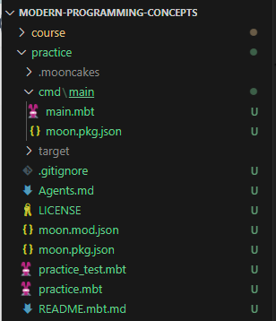

# MoonBit构建系统
- 作者：MoonBit团队
- [官方文档](https://docs.moonbitlang.cn/toolchain/moon/index.html) 
---
- >读者：evinyang
- >时间：2025年10月16日
---
# moon的命令行
## `moon register`
- 在 mooncakes.io 注册一个账户
---
## `moon login`
- 登录到您的账户 = username
---
## `moon new`
- 项目/模块(个人理解)
    - 一个项目文件夹下可以有多个模块，建议使用`moon new`命令使用构建向导，创建自定义项目
    - 项目路径和模块名称无必然联系，可以指定模块名称
    - 如果一个项目文件夹下只有一个模块，此时模块名称可以理解为项目名称
- 创建一个新的 MoonBit 模块
    - 用法：moon new [选项] <路径>
    - 参数：`<PATH>` — 新项目的路径
    - 选项：
        - `--user<用户>` — 包的开发者名称。默认为已登录用户的用户名
        - `--name <名称>`— 包的名称。默认为路径的最后一部分
- 示例：
```sh
moon new ./practice
```
- 模块目录结构图



- 模块目录结构（官方）
```
my_project
├── Agents.md
├── cmd
│   └── main
│       ├── main.mbt
│       └── moon.pkg.json
├── LICENSE
├── moon.mod.json
├── moon.pkg.json
├── my_project_test.mbt
├── my_project.mbt
├── README.mbt.md
└── README.md -> README.mbt.md
```
---
## `moon build`❓

## `moon update`
- 更新包注册表索引
```sh
Registry index updated successfully
```
---
## `moon version`
- 打印版本信息并退出
```sh
moon 0.1.20250902 (c84faf1 2025-09-02)
```
---
## `moon upgrade`
- 升级工具链
```sh
Moonbit installed successfully.
To verify the download binaries, check https://www.moonbitlang.com/download#verifying-binaries for instructions.
To know how to add shell completions, run 'moon shell-completion --help'

Done
```
---
## `moon shell-completion`
- 为 pwsh 生成 shell 补全并输出到标准输出

- `moon shell-completion --help`
```sh
PowerShell:

The powershell completion scripts require PowerShell v5.0+ (which
comes with Windows 10, but can be downloaded separately for windows 7
or 8.1).

First, check if a profile has already been set

    PS C:\> Test-Path $profile

If the above command returns `False` run the following

    PS C:\> New-Item -path $profile -type file -force

Now open the file provided by `$profile` (if you used the
`New-Item` command it will be
`${env:USERPROFILE}\Documents\WindowsPowerShell\Microsoft.PowerShell_profile.ps1`)

Next, we either save the completions file into our profile, or
into a separate file and source it inside our profile. To save the
completions into our profile simply use

    PS C:\> moon shell-completion --shell powershell >>
    ${env:USERPROFILE}\Documents\WindowsPowerShell\Microsoft.PowerShell_profile.ps1
```
