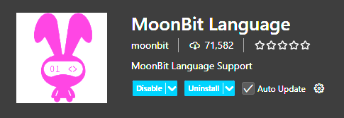

# 现代编程思想课程（MoonBit 月兔编程语言）

## [浏览PDF+观看视频](https://www.moonbitlang.cn/course/)

## 手写课程代码+阅读编程语言文档（doing）

- 手写代码（[样例代码库](https://try.moonbitlang.cn/)）
    - lec4 多元组, 结构体，枚举类型
    - lec5 数据类型
        - 1_dfs_bfs
        - 2_binary_search_tree
        - 3_avl_tree
    - lec6 泛型与高阶函数
        - generic
    - lec7 命令式编程：命令，可变数据结构，循环
        - functional_programming
        - 需再阅读pdf
        - **调试器**：允许在运行中看到实时的运行数据
    - lec8 队列：可变数据实现
        - mutable_queue_stack(代码中留有一个问题)
    - lec9 接口
        - trait(代码中留有一个问题)
    - lec10 哈希表与闭包
        - hashmap_closure(测试出错)
    - lec11 案例：语法解析器与Tagless Final
        - parsec(完美完成)
    - lec12 案例：自动微分
        - [自动微分代码](./lec12/automatic_differentiation.mbt)
    - lec13 案例：基于梯度下降的神经网络
        - [神经网络代码](./lec13/neural_network.mbt)
        - 问题很多需要回顾；另有个报错未解决,解决线索如下：
        - [MoonBit for Component Model](https://docs.moonbitlang.cn/toolchain/wasm/component-model-tutorial.html)
        - [解决'cargo'不是内部或外部命令错误](https://cn.bing.com/search?q=cargo%3A%20The%20term%20%27cargo%27%20is%20not%20recognized%20as%20a%20name%20of%20a%20cmdlet%2C%20function%2C%20script%20file%2C%20or%20executable%20program.%20Check%20the%20spelling%20of%20the%20name%2C%20or%20if%20a%20path%20was%20included%2C%20verify%20that%20the%20path%20is%20correct%20and%20try%20again.&qs=n&form=QBRE&sp=-1&lq=0&pq=&sc=0-0&sk=&cvid=34C688572CEC47EDB1BBCE3C264C0D91)
        - [Windows11上通过国内源安装Rust](https://www.sunzhongwei.com/windows-11-install-rust-with-china-mirror)
    - lec14 案例：堆栈虚拟机
        - [堆栈虚拟机](./lec14/stack_machine.mbt)
        - 有一个警告未处理，需回顾，个别细节未理解

- [阅读月兔语法教程](./月兔语法教程.mbt.md)

- [使用月兔工具链 (todo)](https://docs.moonbitlang.com/zh-cn/latest/toolchain/index.html)
    - [Moon构建系统](./Moon构建系统.md)
    - MoonBit Vscode插件
    
    
    
    - WebAssembly工具链：如何在MoonBit中使用Wasm 

## 推荐阅读（todo）
- coding入门指南 -> 未开始❓

- [Git教程](./适合个人的Git教程.md)👌

- 玩转Vs Code基础 -> 未开始❓

- 《编程语言基础-Agda》
    - ch1 -> Naturals: 自然数 
        - 饱和减法
    - ch2 -> Induction: 归纳证明
    - ch3 -> Relations: 关系的归纳定义
    - ch10 -> Lists: 列表与高阶函数

- 《算法导论》❓
    - ch11 -> 散列表
    - ch12 -> 二叉搜索树
    - ch13 -> 红黑树
    - ch14 -> 数据结构的扩张

- 《算法》❓
    - sec3.4 -> 散列表

- 《范畴论》（中英对照）❓👌
    - ch6 -> 简单的代数数据类型

- 调度场算法❓

- 《现代编译原理》或 斯坦福CS143 第1-8课❓
    - ch1 -> 绪论
    - ch2 -> 词法分析
    - ch3 -> 语法分析

- [3Blue1Brown 深度学习系列（梯度下降法、反向传播算法）](https://space.bilibili.com/88461692/lists?sid=1528929)❓

- [What is a neural network?（什么是神经网络？）](https://www.ibm.com/cn-zh/think/topics/neural-networks)❓

- ⼆村映射/部分计算❓

# 阅读MoonBit核心源码和API文档(todo)

# MoonBit Pilot(为 AI 时代而生的编程语言) (doing)

# 镜像源
## [校园网联合镜像站](https://mirrors.cernet.edu.cn/)
- [镜像列表](https://mirrors.cernet.edu.cn/list)

## 清华大学
- [source.tuna] 
- [registry]("https://mirrors.tuna.tsinghua.edu.cn/git/crates.io-index.git")

## 中国科学技术大学
- [source.ustc]
- [registry]("git://mirrors.ustc.edu.cn/crates.io-index")

## 上海交通大学
- [source.sjtu]
- [registry]("https://mirrors.sjtug.sjtu.edu.cn/git/crates.io-index")

# 国内github访问加速
## 通过修改 hosts 文件加速(效果不佳)
- 打开 hosts 文件
- `Windows`: `C:\Windows\System32\drivers\etc\hosts`
- `Linux`: `/etc/hosts`
```
# 添加以下内容：
140.82.113.4 github.com
185.199.108.153 assets-cdn.github.com
199.232.69.194 github.global.ssl.fastly.net

```
- 保存后刷新DNS缓存：
```
# Windows:
ipconfig /flushdns

# Linux:
sudo systemctl restart nscd

# macOS:
sudo dscacheutil -flushcache
```
## 借助加速工具(效果良好)
- [FastGithub](https://gitee.com/vscene/FastGithub/releases)
- 下载 `fastgithub_win-x64.zip`
- 双击运行`FastGithub.UI.exe`