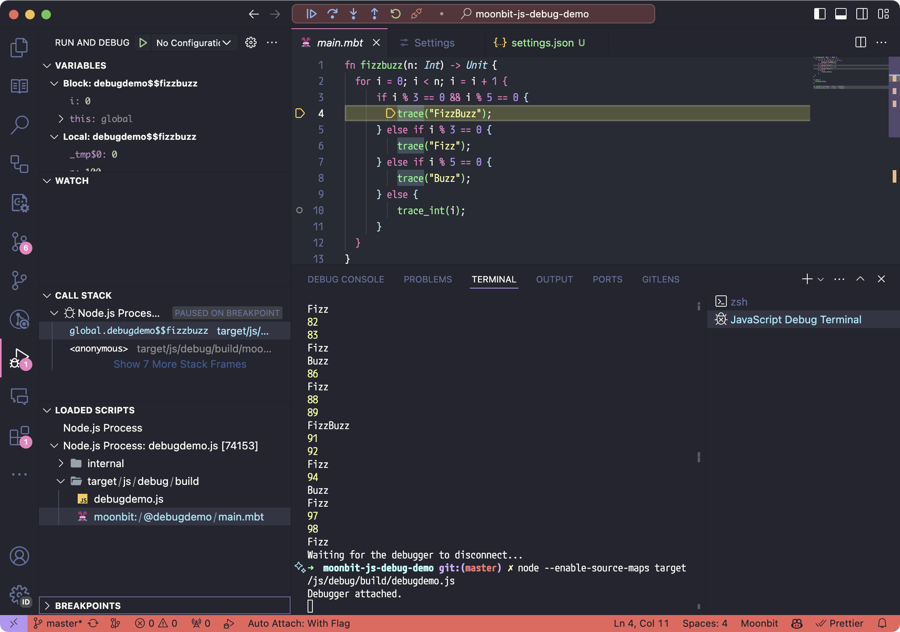

# MoonBit Debugger
- >作者：Evin Yang
- >时间：2025年10月16日11点20分
---
- 1.http Server -> 浏览器F12 -> 调试断点

- 2.Vscode -> 设置断点 -> 直接调试

---
# 在浏览器中进行源码调试（👌）
- 使用构建命令`moon build --debug --target wasm-gc`输出`sourcemap`

- 可用于在浏览器中进行源码调试，具体用法请参考示例项目:
[moonbit-debugging-example](https://github.com/evinyang-zw/moonbit-debugging-example)

- 示例中的调试办法关键：
```sh
# Make sure you have installed moonbit platform first. See https://www.moonbitlang.com/download/
npm install
npm run build
npm run serve
# Open chrome and navigate to http://127.0.0.1:8080/
# Open devtool
# Refresh page, you will see debugger paused at `debugger` statement
```
- 浏览器中调试的参考文档：[每周动态 -> weekly 2023-12-04](https://www.moonbitlang.cn/weekly-updates/2023/12/04/weekly-12-04)

---
# VSCode调试(❓)

- 在本地如果想用vscode调试，你可以借助vscode对node的调试支持来实现

- 首先你需要配置vscode

```json
{
  "debug.allowBreakpointsEverywhere": true
}
```

- 以 [Show case of how to debug under moonbit javascript target](https://github.com/moonbit-community/moonbit-js-debug-demo)为例，你需要打开vscode的javascript debug terminal，然后使用node target/js/debug/build/debugdemo.js来启动调试Session

- 然后由于我们生成的sourcemap将源码统一放到了moonbit://下。所以你需要先在程序断在entry位置，然后从vscode调试器里面loaded scripts中找到对应源码再在上面下断点


- [VSCode调试参考文章](https://taolun.moonbitlang.com/t/topic/756/7?u=evinyang-zw)