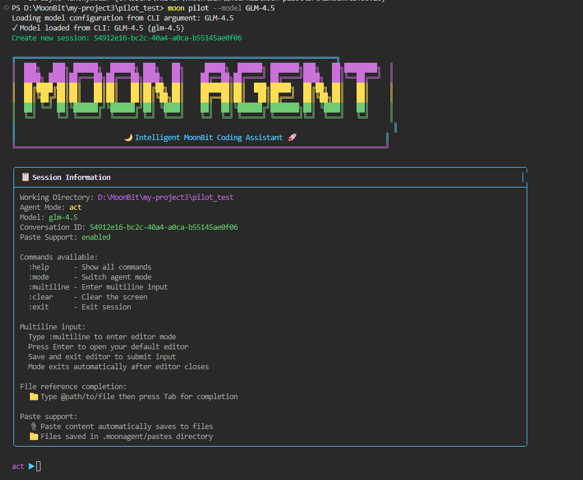
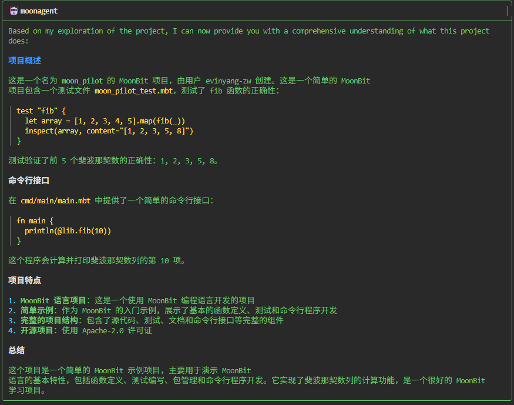

# 入门指南
- MoonBit Pilot



- 释放MoonBit语言原始力量
- 并行重构代码
- 化数小时的工作流程为一个单一的命令
- 是工具又是工作流程
- 让代码库随着你的想象力上限而进化
---
## 1.模型配置
- 使用之前：创建 `~/.moonagent/models/models.json`配置文件，至少配置一个模型
- 配置示例：推荐使用`sonnet4`并且将其放在配置文件的第一个位置。
```json
[
  {
    "name": "sonnet4",
    "description": "Claude Sonnet model for general tasks",
    "model_name": "anthropic/claude-sonnet-4",
    "model_type": "saas/openai",
    "base_url": "https://openrouter.ai/api/v1",    
    "is_reasoning": false,
    "input_price": 3.0,
    "output_price": 15.0,    
    "max_output_tokens": 8096,
    "context_window": 200000,
    "api_key": "your-api-key-here"
  }
]
```
- 我的配置：GLM-4.6/4.5模型
```json
[
  {
    "name": "GLM-4.6",
    "description": "GLM-4.6 model for general tasks",
    "model_name": "glm-4.6",
    "model_type": "saas/openai",
    "base_url": "https://open.bigmodel.cn/api/paas/v4/chat/completions",    
    "is_reasoning": true,
    "input_price": 0.0,
    "output_price": 0.0,  
    "max_output_tokens": 128000,
    "context_window": 200000,
    "api_key": "your-api-key-here"
  },
  {
    "name": "GLM-4.5",
    "description": "GLM-4.5 model for general tasks",
    "model_name": "glm-4.5",
    "model_type": "saas/openai",
    "base_url": "https://open.bigmodel.cn/api/paas/v4/chat/completions",
    "is_reasoning": true,
    "input_price": 0.28,
    "output_price": 2.28,
    "max_output_tokens": 96000,
    "context_window": 128000,    
    "api_key": "your-api-key-here"
  }
]
```
### 1.1 配置字段说明
```sh
name: 模型的唯一标识符（用于参考）

description: 模型的可读描述

model_name: API 提供商使用的实际模型标识符

model_type: API 接口类型（目前支持 "saas/openai"）

base_url: 模型提供商的 API 端点 URL

is_reasoning: 是否为推理模型（影响 token 计数）

input_price: 每百万输入 token 的成本（美元）

output_price: 每百万输出 token 的成本（美元）

max_output_tokens: 模型可以输出的最大 token 数

context_window: 总上下文窗口大小（以 token 为单位）

api_key: 您此提供商的 API 密钥
```
### 1.2 获取 API 密钥
- 使用模型需要获取API密钥（z_ai_apikey）
- 在配置中将`"your-api-key-here"`替换为你的实际API密钥
---
## 2. 设置
- 安装`Node.js v22.16.0`然后运行：
```mbt
moon pilot
```
---
## 3. 用法
- 自动使用配置文件中的第一个模型
- 可以配置多模型，在启动时通过参数`--model`指定
---
## 4. 交互模式
- 默认模型启动交互模式
```mbt
moon pilot
```
- 指定特定模型
```mbt
moon pilot --model \{name}
```
- 💡使用的是配置文档中name字段值而不是model_name字段值
- 启动交互模式示例
```sh
moon pilot --model GLM-4.5
```
```sh
│ 工作目录: D:\MoonBit\my-project3\moon_pilot  │
│ 代理模式: act                                       │
│ 模型: glm-4.5                                        │
│ 对话 ID: b1ecae72-b24e-4f9b-98c6-0800fb3b5c8f │
│ 粘贴支持：已启用                                │
│                                                       │
│ 可用命令：                                       │
│   :help      - 显示所有命令                      │
│   :mode      - 切换代理模式                          │
│   :multiline - 进入多行输入                          │
│   :clear     - 清屏                                   │
│   :exit      - 退出会话                               │
│                                                       │
│ 多行输入：                                          │
│   输入 :multiline 进入编辑模式                      │
│   按回车键打开默认编辑器                           │
│   保存并退出编辑器以提交输入                          │
│   编辑器关闭后模式自动退出                          │
│                                                       │
│   文件引用补全：                                      │
│   📁 输入 @path/to/file 然后按 Tab 键进行补全 │
│                                                       │
│ 粘贴支持：                                        │
│   📎 粘贴内容自动保存到文件                       │
│   📁 存储在 .moonagent/pastes 目录中的文件
```
### 4.1 交互式命令
- 输入需求, MoonBit Pilot响应并执行任务
```mbt
act ▶ 这个项目是做什么的？
```
- 💡如果这一步报错，结合报错信息检查配置文档以下字段是否正确
  - `model_type`:`saas/openai`(必须是这个)
  - `base_url`
  - `api_key`
- 💡修改配置文档后，需退出应用程序重新进入交互模式才可生效
- moonagent 输出示例



- 任务1：
```sh
act ▶ 写一个AVL tree测试并执行
```
1. 创建AVL树的数据结构定义（AVLNode, AVLTree）
2. 实现AVL树的核心操作（插入、删除、旋转）
3. 实现AVL树的辅助操作（高度计算、平衡因子、验证）
4. 编写AVL树的测试用例
5. 运行测试验证正确性
### 4.2 退出交互模式
- 使用`:exit`或`Ctrl+D`退出应用程序
- 使用`Ctrl+C`停止当前请求并清除当前输入
---
## 5. 打印/非交互模式
- 通过 `-p` 标志执行一次性命令

- 非交互模式支持管道：
```mbt
echo "这个项目是做什么的" | moon pilot -p
```
>该命令将在完成后自动退出，适合程序化调用（通过编程语言中的子进程派生或`shell`脚本调用）。

- 可以将它与 `cat` 一起使用：
```mbt
cat prompt.md | moon pilot -p
```
### 5.1 非交互模式的`会话`概念
>之前的命令每个都会创建一个`新会话`，可以简单地理解为`无状态`的。

- 通过 `conversations` 查看最近执行的`非交互式命令`:
```mbt
moon pilot conversations
```

- 通过会话 ID 查看详情：
```mbt
moon pilot conversation \{id}
```

- 将会话`导出`到 markdown 文件：
```mbt
moon pilot conversation \{id} --output \{xx.md}
```
### 5.2 共享会话
> 如果你想从上一个命令执行处继续，让这次修改拥有上次的上下文，你可以使用 `--continue` 来继续上一个会话。这样，两个命令将共享同一个对话列表。

- 使用`--continue`共享上一次对话信息
```mbt
echo "我之前问了你什么？" | moon pilot -p --continue
```

> 这允许你通过多次 moon pilot 调用来完成对话。这意味着任何第三方应用程序都可以通过简单的命令行调用轻松地与 moon pilot 集成。未来，我们还可以为各种语言提供 SDK，方便其他语言使用 moon pilot 创建交互式界面并实现包迁移工作。

### 5.3 恢复会话
- 使用 `--resume` 参数恢复到特定会话
```mbt
echo "我之前问了你什么？" | moon pilot -p --resume \{id}
```

> 以上证明MoonBit Piolt提供了出色的`交互可控性`